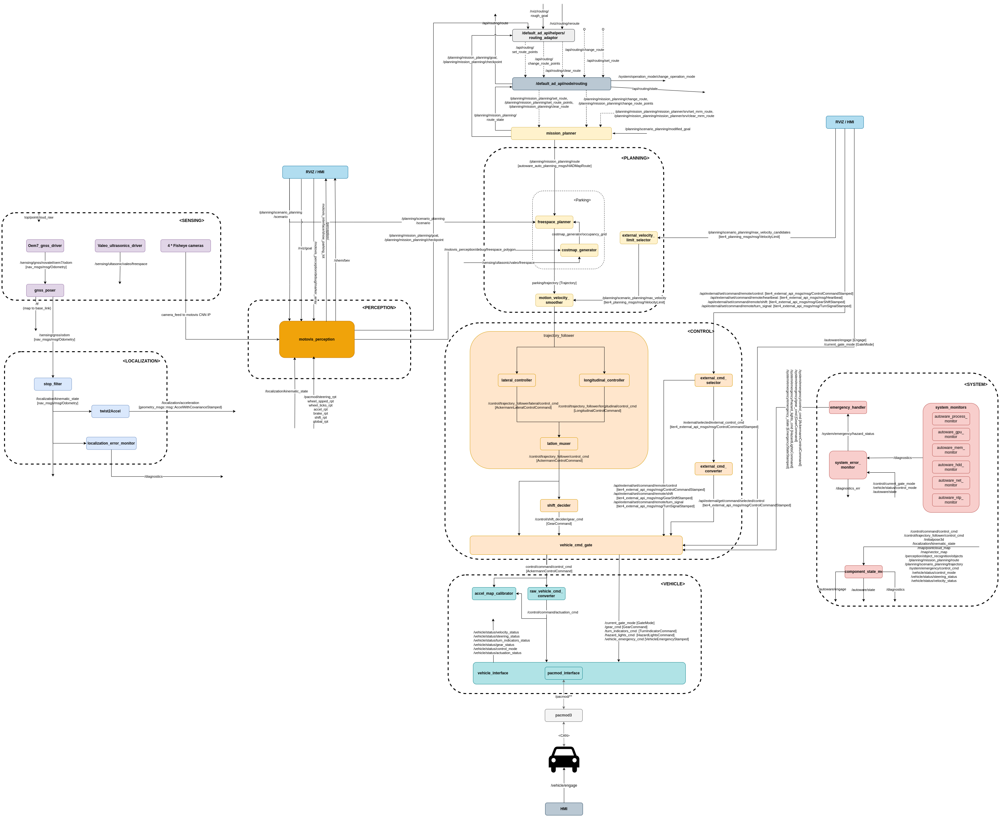
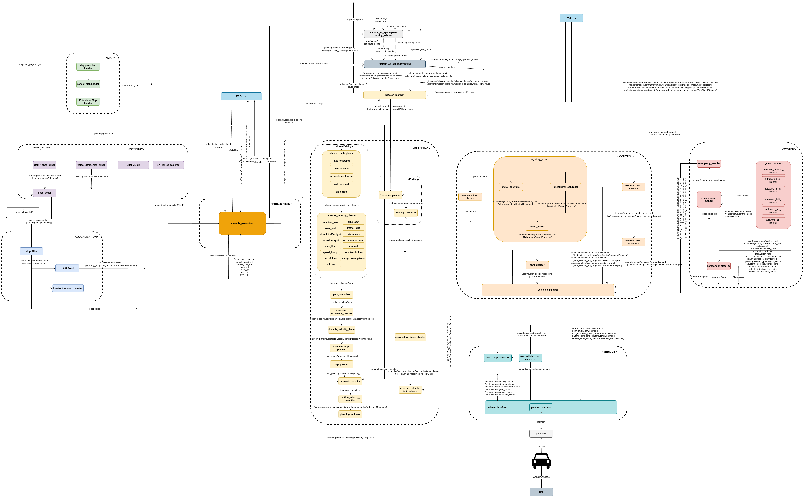
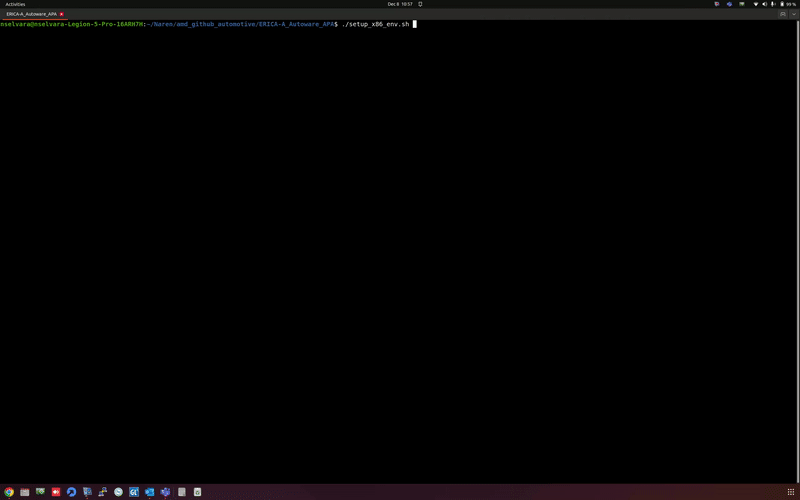
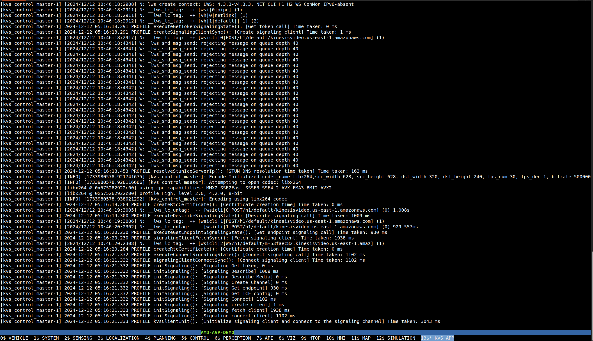
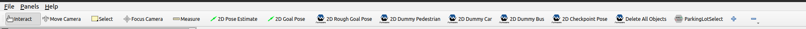
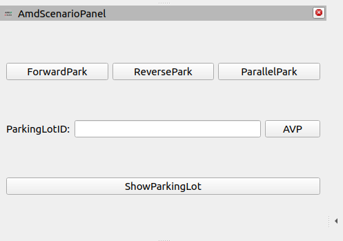
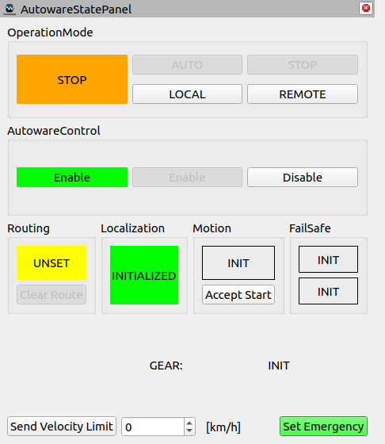
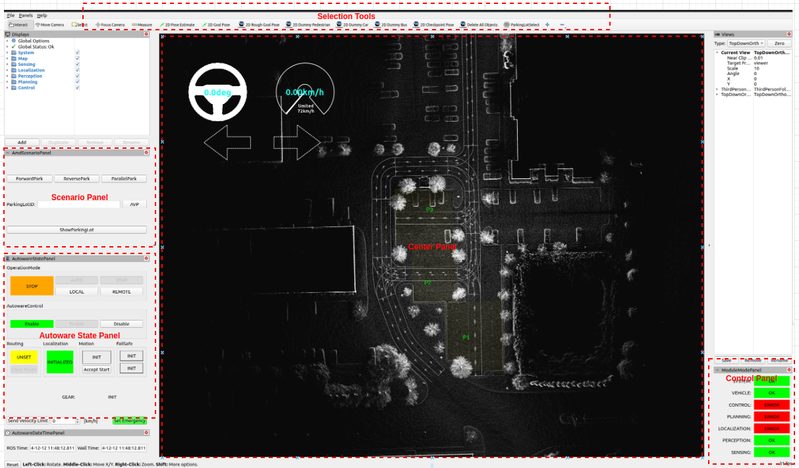
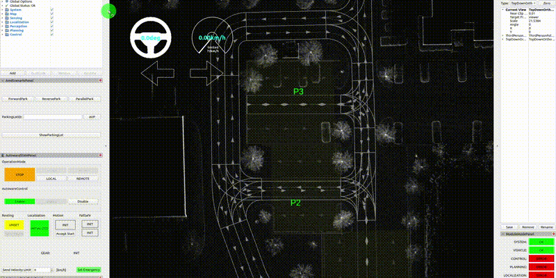
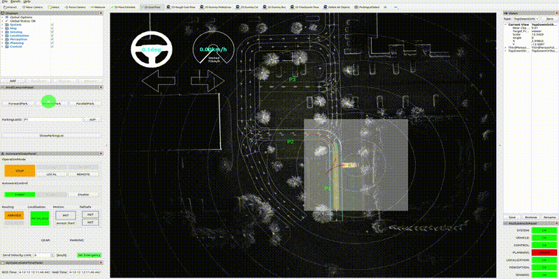

<table>
 <tr>
   <td align="center"><h1>Autoware APA & AVP</h1>
   </td>

</table>

# APA Architecture
***Click Here to See More***
<details>
 
Modified and optimized version of Autoware vertical stack for APA POC needs. Few notable changes from opensource Autoware SW stack,
* *Sensing* - LIDARs are not used for localization instead we are using GNSS based localization for APA.
* *perception* - Using vision based perception for parking lot detection and freespace segmentation.
* *planning* - Using only the freespace planner instead of behavior planner which is used for lane driving.
* *localization* - RTK GNSS based localization instead of LIDAR pointcloud based localization.
<div align="center">



</div>
 </details>
 
 # AVP Architecture
***Click Here to See More***
<details>
 
Modified and optimized version of Autoware vertical stack for AVP POC needs. Few notable changes from opensource Autoware SW stack,
* *Sensing* - LIDARs are not used for localization instead we are using GNSS based localization for AVP
* *perception* - Using vision based perception for parking lot detection and freespace segmentation. Obstacle avoidance is yet be considered on lane driving scenario. But on parking we are using Ultrasonics to avoid obstacle at low speed parking.
* *planning* - AVP is combination of lane driving and parking scenarios , BH Planner is used for lane driving and Freespace planner is used for parking scenario. Separate module called "avp_planner" module is used to control the state change from one scenario to other.
* *localization* - RTK GNSS based localization instead of LIDAR pointcloud based localization.
* *Map* - Since our systems are Vision based , we use Lidars to generate PCD map(using LIO-SAM) and using PCD we created OSM Lanelet map(using vector-map builder tool) which is needed by planner module to do lane driving to reach a parking lot.
* *Rviz* - Plugins to support parking lot / space selection.
<div align="center">



</div>
 </details>

# Building Autoware
***Click Here to See More***
<details>
  
 ## Building Autoware for x86

 - **Prerequisite**
    * Ubuntu 22.04 OS
    * Ros2 humble need to be installed [ros_humble](https://docs.ros.org/en/humble/Installation/Ubuntu-Install-Debians.html)
 - **Steps**
    ```
    ./setup_env.sh -t x86
    ```
    ```
    Usage:
      ./setup_env.sh -t [-s] [-l] [-d] [-p] [-N] [-L] [-h] [-S]
         -t - Target platform x86
         -s - Skip setting the build configurations
         -d - Enable debug mode in colon build
         -p - List of ros2 packages to build
         -P - No parallel workers for colon build(def: 10)
         -L - CMAKE parallel build level(def: 1)
         -S - Skip a set of packages which have finished to build previously
         -l - Extended cmake logs
         -h - Help
    ```
    * Kindly note that while running the script it expects inputs from user like **"ROS2 install path"**.eg: usual ros2 env will be available under "/opt/ros/humble"
    * On successful compilation the install directory gets generated under **"autoware/install/x86/install"**
 
    <table>
    <tr>
     <td align="center">
    </td>
    </table>
 
 
    
 ## Details about the setup scripts
 
 The setup scripts mentioned above does the following,
   * Untar & uncompress the compressed files into the patch directory 
   * Gets the build environment configurations from user 
   * clone the autoware repo under ***autoware*** directory and switch to 2023.06 release 
   * Using vcs tool imports all the source files needed for AW 
   * Imports the additional dependencies needed for compilation
   * Try to install deps for all the packages using rosdep (happens only for x86 build) 
   * Patch the APA|AVP related changes from patch_2023_06 to autoware src 
   * Colcon Ignores unnecessary modules which are not be compiled
   * Finally starts the compilation 
 
  ## Tips & Tricks
  
 * If you face below mentioned issue ,
 
      ```
      aarch64-xilinx-linux-g++: fatal error: Killed signal terminated program cc1plus
      compilation terminated.
      gmake[2]: *** [CMakeFiles/vehicle_cmd_gate_node.dir/build.make:76: CMakeFiles/vehicle_cmd_gate_node.dir/src/vehicle_cmd_gate.cpp.o] Error 1
      gmake[2]: *** Deleting file 'CMakeFiles/vehicle_cmd_gate_node.dir/src/vehicle_cmd_gate.cpp.o'
      gmake[1]: *** [CMakeFiles/Makefile2:87: CMakeFiles/vehicle_cmd_gate_node.dir/all] Error 2
      gmake: *** [Makefile:146: all] Error 2
      ```
 this is due to insufficient cpu power to compile the AW. By default the MAX cpu cores are used in the ros_build.sh script to compile.
 Kindly modify ***--parallel-workers {NUM}*** variable in ros_build.sh script to a lower value. Before starting again remove the **build** under **autoware** 
 
 </details>
 
 
 # Launching Autoware
***Click Here to See More***
<details>
 
 All the launch related files are available under **launch_scripts** directory. To launch the system use the below mentioned command.
 ```
 ./launch_scripts/launch.sh -c launch_scripts/launch.config 
 ```
 - **Prerequisite**
   * Install GNU Screen if launching via Screen.Screen is used to launch AW core modules in separate windows which makes it better for debugging.
   ```
   sudo apt-get install screen
   ```
 
 - **Launch_scripts Directory Tree View**
 ```      
├── launch_api.sh                 --> API modules launch script
├── launch.config                 --> Launch env config file
├── launch_control.sh             --> Control modules launch script
├── launch_htop.sh                --> Htop launch
├── launch_map.sh                 --> Map launch
├── launch_localization.sh        --> Launch script for localization
├── launch_perception.sh          --> Perception launch script
├── launch_planning.sh            --> Planning launch
├── launch_sensing.sh             --> sensing launch script
├── launch.sh                     --> Main launch file which calls all other launch files
├── launch_sim.sh                 --> Simulation launch script
├── launch_system.sh              --> System launch script
├── launch_vehicle.sh             --> Vehicle module launch
├── launch_viz.sh                 --> Vistualization related launch (rviz)
├── launch_kvs.sh                 --> AWS KVS master application related launch (rviz)
├── ros_env.sh                    --> ROS ENV related bash script will be sourced in all terminals before launching for x86
├── screenrc                      --> GNU screen related configurations
 
 ```
 
 ## About launch.config 
 * All the launch related environment configurations can be modified using this one stop config file.
 * General parameters need to be modified based on the current launching environment.
 * AUTOWARE_LAUNCH_PLATFORM_CFG paramter is used to select the target platform environment for the launch. If "SIM" is selected simulation environment will be launched. Select "LEXUS" to use Lexus450H vehicle on real time to demonstrate.
 * AUTOWARE_LAUNCH_SCENARIO_CFG parameter is used to select between "APA" or "AVP" scenario
 * We can configure individual core modules to be launched either on the "target" or "target from x86" or "on the x86 PC" or we can disable the launch as well. Kindly use TGT or X86 or TGT_FROM_X86 or or NO respectively based on the needs.
 
 ``` 
 **#General configurations** 
 SYSTEM_PWD_CFG="admin123"  **#change to system password**
 AUTOWARE_LAUNCH_SCRIPT_X86_PATH_CFG=""    **#x86 Launch_script path**
 AUTOWARE_INSTALL_X86_PATH_CFG=""          **#Autoware install path on x86**
 AUTOWARE_LAUNCH_MAP_PATH_CFG=""           **#Map dir path for AVP**

**#Platform configuration**  
 AUTOWARE_LAUNCH_PLATFORM_CFG="SIM" # SIM
 AUTOWARE_LAUNCH_SCENARIO_CFG="AVP" # APA or AVP

**#Core Module launch configurations X86 or NO
**#select x86 to launch individual module on x86 PC
**#select NO to not to launch**  
 AUTOWARE_LAUNCH_VEHICLE_CFG="X86"
 AUTOWARE_LAUNCH_PLANNING_CFG="X86"
 AUTOWARE_LAUNCH_CONTROL_CFG="X86"
 AUTOWARE_LAUNCH_PERCEPTION_CFG="X86"
 AUTOWARE_LAUNCH_LOCALIZATION_CFG="X86"
 AUTOWARE_LAUNCH_SENSING_CFG="X86"
 AUTOWARE_LAUNCH_SYSTEM_CFG="X86"
 AUTOWARE_LAUNCH_API_CFG="X86"
 AUTOWARE_LAUNCH_HTOP_CFG="X86"
 AUTOWARE_LAUNCH_VIZ_CFG="X86"
 AUTOWARE_LAUNCH_MAP_CFG="X86"
 AUTOWARE_LAUNCH_SIM_CFG="X86"
 ``` 
 ## Launching for Simulation {X86}
 To launch the Simulation environment ,
 * Modify the launch.config generate configurations based on your current system env.
 * Select **SIM** for ***AUTOWARE_LAUNCH_PLATFORM_CFG*** parameter
 * Launch the system using the following command ***./launch.sh -c ./launch.config***
 * we should see a GNU screen named "AVP-DEMO" with 13 individual tabs opened for individual core modules. Some useful commands to navigate through the screen, 
 
 ```
 ctrl + a + {0-11} - To switch to individual tabs
 ctrl + a + {n or p} - To switch to next or previous tab
 ctrl + a + d  - To detach from screen
 ctrl + a + ctrl + [ - To scroll through the logs in individual tabs
 screen -XS AVP-DEMO quit - To quit the screen
 screen -list - To list avilable screen
 ```
 
 <div align="center">
  

  
</div>
 
 * Along with the terminals we should see Rviz , HMI (if enabled) & rqt_robot_monitor are also launched.
 * The Rviz has following plugins to support APA & AVP functionality,
    *  **Selection Tools** - This panel has tools for selecting the initial pose for the vehicle , select a random goal pose, create Dummy car object , select the parking slot.
       * 2D Pose Estimate - Used to set the initial pose on the center panel
       * 2D Goal Pose     - Used to set the goal pose for the ego vehicle
       * 2D Dummy Car & Delete All Objects - Used to creat dummy cars and delete the created one
       * ParkingLot Select - To select a parking lot
       <div align="center">
   
         
  
       </div>
    * **AmdScenarioPanel** - Used to select the parking scenario.
       * ForwardPark - This button used to select the forward parking scenario
       * ReversePark - This button used to select the reverse parking scenario
       * ParallelPark - This button used to select the parallel parking scenario
       * ShowParkingLot - to refresh the parking lots
       * ParkingLotID textbox & AVP push button-  Enter the parking lot ID (IDs of the parking lots are displayed on the rviz center console while loading the OSM map) and click on AVP button to initiate AVP scenario
       <div align="center">
  
         
   
       </div>
    * **Autoware Control Panel** - Used to modify the autoware control states.
       * OperationalMode:
          * AUTO  - This button is used to select the Autonomous mode
          * LOCAL -  This button is used to select Local Manual Control mode
          * REMOTE - Used to select Remote contolling of the vehicle via JoySticks etc
          * STOP  - Stop the vehicle 
       * AutowareControl:
          * Enable - This button is used to enable the Autoware to control the Ego vehicle
          * Disable - To disable the autoware control
       <div align="center">
 
         
   
       </div>
    * **Module Status Panel** - Shows the individual modules current status as { OK or ERROR or INIT }. Initally all except CONTROL , PLANNING & LOCALIZATION modules will be in OK state. This is because we yet to select the initial position for the vehicle localization and goal pose for the planning & control module to work on the trajectories.
    * **Center Panel** - This panel is where all the action happens with respect to simulation. Shows vehicle movement , vehicle steering & speed status on the top right , shows parking lots etc.
 
 rviz_panel<div align="center">

  
 
 </div> 
 
 ## Steps for executing a APA SIM scenario 
 
 1. Use **2D Pose Estimate** button on the Selection Tool panel to set the initial position of the ego vehicle on the center panel. On selecting the initial pose the LOCALIZATION module status turns to OK state.
 2. Press **ShowParkingLot** button on the Scenario Panel to refresh the parking lots
 3. Use **ParkingLotSelect** button on the selection Tool Panel to select a parking lot that is shown on the center panel
 4. Select a scenario REVERSE or FORWRD or PARALLEL on the Scenario Panel. On selecting a scenario the PLANNING & CONTROL module status will be turned OK.
 5. Ensure all the modules are in OK state in the Module Status Panel.
 6. Now Kick in the Autonomous mode using AUTO button  on the Autoware State Panel. To stop use STOP button. On simulation AutowareControl state is enabled by default.
 
    <table>
    <tr>
     <td align="center">
    </td>
    </table> 
  
 ## Steps for executing a AVP SIM scenario using RVIZ
 
 * **PARKING**
   1. Set Platform configuration ,AUTOWARE_LAUNCH_PLATFORM_CFG="SIM" and AUTOWARE_LAUNCH_SCENARIO_CFG="AVP". Ensure map path is set properly "AUTOWARE_LAUNCH_MAP_PATH_CFG"
   2.  Use **2D Pose Estimate** button on the Selection Tool panel to set the initial position of the ego vehicle on the center panel. On selecting the initial pose the LOCALIZATION module status turns to OK state.
   3. On successful launch we should see the map & parking lots shown on the center panel
   4. set parking lot ID in **ParkingLotID** text box and press the AVP button on the sceanrio Panel to select the parking lot to which you want to navigate the ego vehicle.
   5. To create dummy parking spaces change the following in motovis_interface pkg [patch_2023_06/src/universe/autoware.universe/perception/amd_xilinx_perception/motovis_interface/motovis_interface_src/CMakelist.txt] define **AVP**
   6. Ensure all the modules are in OK state in the Module Status Panel.
   7. Now Kick in the Autonomous mode using AUTO button  on the Autoware State Panel. To stop use STOP button. On simulation AutowareControl state is enabled by default.
    
    <table>
    <tr>
     <td align="center">
    </td>
    </table>
 
 * **SUMMON**
   1. Using **2D Goal Pose** button on the selection tool panel set a goal pose on any routable lane from the parked parking space.
   2. Now you should see a path between the ego vehicle to goal pose , if not the the goal pose is set on the lane which might not be routable.
   3. Ensure all the modules are in OK state in the Module Status Panel.
   4. Now Kick in the Autonomous mode using AUTO button  on the Autoware State Panel. To stop use STOP button. On simulation AutowareControl state is enabled by default.
 
    <table>
    <tr>
     <td align="center">
    </td>
    </table>

# Support

GitHub issues will be used for tracking requests and bugs. For questions go to [forums.xilinx.com](http://forums.xilinx.com/).

# License

Licensed under the Apache License, Version 2.0 (the "License"); you may not use this file except in compliance with the License.

You may obtain a copy of the License at [http://www.apache.org/licenses/LICENSE-2.0]( http://www.apache.org/licenses/LICENSE-2.0 )


Unless required by applicable law or agreed to in writing, software distributed under the License is distributed on an "AS IS" BASIS, WITHOUT WARRANTIES OR CONDITIONS OF ANY KIND, either express or implied. See the License for the specific language governing permissions and limitations under the License.

<p align="center"> XD016 | &copy; Copyright 2022–2023 AMD, Inc.</p>
